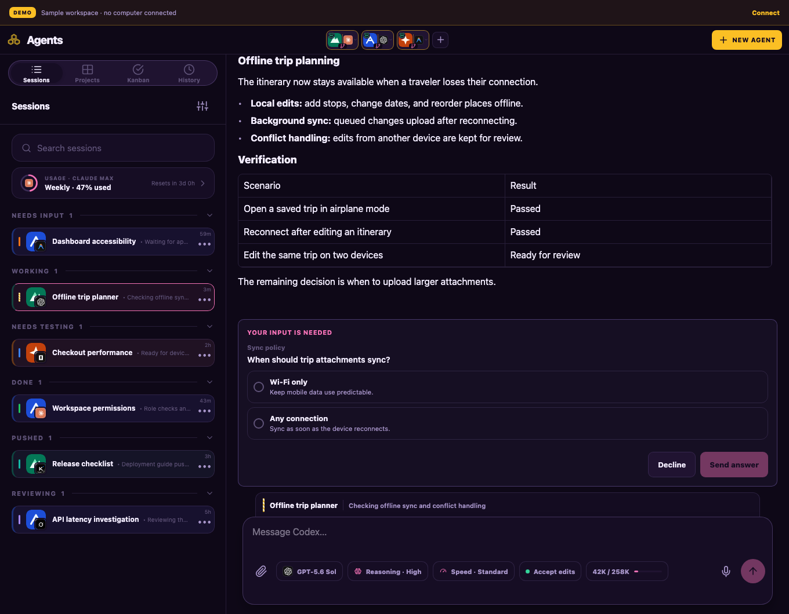
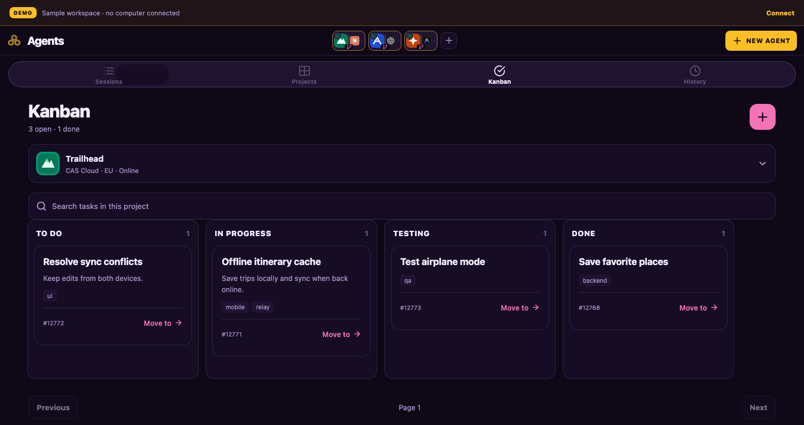

# CAS Cloud

**Run Codex, Claude, Kimi and more in one app — with projects, Kanban and parallel agent sessions.**

Give each agent a job, follow its progress and review its work in a shared
workspace. CAS Cloud brings **Codex, Claude, OpenCode, Kimi, Antigravity, Grok,
Cursor and Pi** together with live conversations, project files, Git changes
and a Kanban board.

Your agents run on your Mac, Linux machine or VPS. Connect through
CodeAgentSwarm Desktop or your own web app, and keep working from your computer
or phone while the host stays online. Use your own provider accounts and,
with the included self-hosting stack, your own web client, API and relay.



*The real web interface with a fictional sample workspace. Projects, conversations
and results in these screenshots are demonstration data.*

## Your agents, projects and tasks in one workspace

### Work with the agent you choose

- **Eight coding agents in one interface.** Use Codex, Claude, OpenCode, Kimi,
  Antigravity, Grok, Cursor and Pi with your existing provider accounts.
- **Parallel sessions across projects.** Let Codex build a feature while Claude
  reviews another project and Kimi investigates a bug.
- **Live chat and tool activity.** Send prompts, follow streamed replies and
  see the commands and tools your agents use.
- **Approvals and questions.** Approve commands and answer questions from the
  same conversation, including from your phone.
- **Models and reasoning controls.** Choose the model, reasoning effort and
  permission options supported by each provider.
- **Conversation history and handoffs.** Reopen supported conversations or
  continue with another agent using a context handoff. Resumable sessions are
  restored after host restarts.

### Keep the whole project in view

- **Projects in one place.** Register existing folders, clone repositories and
  launch agents in the project you want to work on.
- **A built-in Kanban board.** Create tasks, organize the backlog and move work
  through To do, In progress, Testing and Done alongside your conversations.
- **Agent goals, activity and status.** See what each session is doing and
  which agents are Working, waiting for input, ready for testing or Done.
- **Files and Git without leaving the app.** Browse and search project files,
  read source, inspect diffs and commit history, and manage branches.
- **Attachments and shortcuts.** Give supported agents files or images for
  context, and save project-and-agent shortcuts to launch recurring work quickly.



*Keep the project backlog and its progress alongside your agent conversations.*

### Keep work moving from anywhere

- **Desktop and browser access.** Connect from CodeAgentSwarm Desktop or the
  included web client on a computer or phone.
- **Agents that stay on the host.** Leave work running on your Mac, Linux
  machine or VPS while you switch clients or close the browser.
- **Communication between sessions.** With approved links and session
  communication enabled, ask an agent to consult another eligible session or
  start work on a linked machine.
- **Your own infrastructure.** Self-host the web client, API and Cloudflare
  relay. Pair devices with temporary codes, revoke access when needed and
  exchange messages through the end-to-end encrypted relay.

## Choose how to connect

| | With CodeAgentSwarm Desktop | With your own infrastructure |
| --- | --- | --- |
| Where agents run | Your Mac, Linux machine or VPS | Your Mac, Linux machine or VPS |
| Client | CodeAgentSwarm Desktop | The included web client; Desktop can also connect |
| Connection infrastructure | CodeAgentSwarm's hosted relay and API | Your Cloudflare relay and independent API |
| What you deploy | The CAS Cloud host | Host, web client, API and relay |
| Start here | [Install the host](#install) | [Self-hosting guide](self-hosting/README.md) |

Both options use the encrypted relay protocol. The agent host opens no public
inbound port and exposes only the projects you register. Browser clients pair
with a one-time code; pairing gives each device a revocable credential.

## Install

Use Node.js 22.19.0 or newer, npm and Git on the machine that runs your agents.
Sign in to the providers you want to use on that machine. Connecting through
CodeAgentSwarm Desktop does not require Docker, Caddy or a Cloudflare account.

For a fully self-hosted installation, see the
[requirements and deployment options](self-hosting/README.md#requirements).
Caddy is the web server used by the supplied example; you can use an existing
HTTPS server or static hosting instead. Node runs the agent host and API; the
compiled web client needs only a browser and static hosting.

```sh
npm install --global @codeagentswarm/cas-cloud
cas-cli --version
cas-cli doctor
cas-cli serve \
  --project /absolute/path/to/project-a \
  --project /absolute/path/to/project-b \
  --projects-root /absolute/path/to/clones
```

`npx @codeagentswarm/cas-cloud serve ...` works without a global install. Before opening
the relay, `serve` checks and installs the supported agent CLIs and the
bundled CodeAgentSwarm MCP. It also installs the guarded global instructions
that publish each session's title, activity and work-phase status. Run
`cas-cli setup` to perform that same setup explicitly.

To connect this host to CodeAgentSwarm Desktop, keep `serve` running and ask it
for a temporary Desktop link:

```sh
cas-cli connect
```

Open the printed link on the Mac, or paste it into **Remote devices**. Desktop
reviews and saves the host; its projects and open sessions then appear in the
normal Agents list and New Agent launcher while the VPS is online. The link is
single-use, expires after five minutes, uses the existing encrypted relay and
does not open an inbound VPS port.

To let a Cloud session read or start work on your Mac, enable **Session
communication** on the Mac, create a Mobile Connect pairing code, and keep the
Cloud service running while you link it:

```sh
cas-cli link 7K9D-M2QF
cas-cli remote-status
cas-cli unlink
```

The Mac must approve the matching six-digit verification code. The link is
revocable and end-to-end encrypted through the existing relay. Cloud agents can
list eligible Mac sessions, read a bounded user/assistant transcript, or list an
opaque project and start one new Mac session with a prompt when you explicitly
ask. Only assistant prose returns; paths, reasoning and tool output do not.

The Desktop connection created by `cas-cli connect` provides the reverse direction. With both
links approved, a Mac session can perform the same explicit read, remote start,
or focused request/response exchange with an eligible CAS Cloud session. Those
messages stay end-to-end encrypted and are not retained for replay by the relay.

`cas-cli` is the collision-safe executable name. The `cas-cloud` alias lets npm
infer the executable for `npx @codeagentswarm/cas-cloud`; the shorter `cas` alias
is also installed.

<details>
<summary>Optional: development previews</summary>

## Ephemeral development previews

`cas-preview` is an optional, separate service for temporary browser previews. It
starts and owns each development command, exposes it through an unguessable path,
and terminates the whole process group after a hard two-hour TTL. It listens on
loopback plus a mode-`0600` Unix control socket by default; the main CAS Cloud
runtime still opens no inbound listener.

Install `systemd/cas-preview.service.example` as a system service, adjust
its project root and public origin, and put the matching
`caddy/Caddyfile.preview.example` site behind a domain you control. Then start a
temporary app with:

```sh
cas-preview start --cwd /srv/cas-projects/my-app --port 4173 -- \
  npm run dev -- --host 127.0.0.1 --port 4173
cas-preview list
cas-preview stop LEASE_ID
```

The service refuses to adopt a port that was already listening, so it never kills
an unrelated process. The generated URL is a bearer capability rather than login
authentication; do not use it for sensitive or production data.

The executable has no vendor-specific domain or filesystem root. `serve` accepts
`--public-origin`, `--root`, `--socket`, `--ttl-seconds`, `--listen`, and `--port`;
`CAS_PREVIEW_PUBLIC_ORIGIN`, `CAS_PREVIEW_ROOT`, and `CAS_PREVIEW_SOCKET` provide
deployment-level defaults. Without deployment configuration it stays local, uses
the current directory as its root, places the control socket in `XDG_RUNTIME_DIR`
or the OS temporary directory, and prints a loopback URL.


</details>

Mobile and Desktop show the supported provider CLIs. On CAS Cloud, Mobile exposes
provider status and one **Sign in** button; the host launches the provider's
official login and keeps its credentials locally. Codex uses device
authentication so no callback port is required on the VPS. Provider accounts
are separate from the CAS account. On Linux, set `CAS_ACCESS_TOKEN`; optionally set
`CAS_REFRESH_TOKEN` so an expired access token can be renewed. `CAS_CLI_CONFIG`
overrides the identity file. Otherwise Linux stores it under
`$XDG_CONFIG_HOME/codeagentswarm` when `XDG_CONFIG_HOME` is absolute, or
`~/.config/codeagentswarm`.

CAS Cloud supports Claude, Codex, Antigravity, OpenCode, Kimi, Grok, Cursor and Pi through the shared CodeAgentSwarm driver layer.
It publishes the same account-usage quotas as Desktop, and Mobile Settings can add,
edit or remove the project shortcuts stored by this CAS Cloud runtime.

<details>
<summary>Run as a Linux service, update and recover</summary>

## Linux user service with automatic updates

The service uses a stable `current` symlink so an update can be installed beside
the running version, health-checked, and rolled back without overwriting it.
Bootstrap that managed installation once:

```sh
mkdir -p "$HOME/.local/share/codeagentswarm-cloud/releases/initial"
npm install --prefix "$HOME/.local/share/codeagentswarm-cloud/releases/initial" --omit=dev --no-audit --no-fund @codeagentswarm/cas-cloud@latest
ln -sfn "$HOME/.local/share/codeagentswarm-cloud/releases/initial" "$HOME/.local/share/codeagentswarm-cloud/current"
```

Copy the three templates to `~/.config/systemd/user`, remove the `.example`
suffixes, and replace the project paths in `cas-cli.service`. Keep credentials in
`~/.config/codeagentswarm/cas-cli.env` with mode `0600`; use
`CAS_ACCESS_TOKEN` and, when available, `CAS_REFRESH_TOKEN` there. Do not put
tokens in `ExecStart` or shell history. If Node came from nvm, edit the `PATH=`
line in both services to include that Node version's `bin` directory.

When upgrading from Node 20 or Node 22 older than 22.19.0, install a supported
Node version first. Keep it isolated to these services if other applications
need the old runtime. Stage the new CAS Cloud package with the new Node/npm so
native dependencies match it. Preserve the previous Node path for rollback:
restoring an older package also requires its matching Node runtime. Do not run
an existing Node 20 installation's native dependencies under Node 22.

```sh
mkdir -p ~/.config/systemd/user ~/.config/codeagentswarm
cp "$HOME/.local/share/codeagentswarm-cloud/current/node_modules/@codeagentswarm/cas-cloud/systemd/cas-cli.service.example" ~/.config/systemd/user/cas-cli.service
cp "$HOME/.local/share/codeagentswarm-cloud/current/node_modules/@codeagentswarm/cas-cloud/systemd/cas-cli-update.service.example" ~/.config/systemd/user/cas-cli-update.service
cp "$HOME/.local/share/codeagentswarm-cloud/current/node_modules/@codeagentswarm/cas-cloud/systemd/cas-cli-update.timer.example" ~/.config/systemd/user/cas-cli-update.timer
touch ~/.config/codeagentswarm/cas-cli.env
touch ~/.config/codeagentswarm/cas-cli-update.env
chmod 600 ~/.config/codeagentswarm/cas-cli.env ~/.config/codeagentswarm/cas-cli-update.env
systemctl --user daemon-reload
systemctl --user enable --now cas-cli cas-cli-update.timer
systemctl --user status cas-cli
systemctl --user list-timers cas-cli-update.timer
systemctl --user kill --kill-whom=main --signal=SIGUSR1 cas-cli
systemctl --user disable --now cas-cli-update.timer cas-cli
rm ~/.config/systemd/user/cas-cli.service ~/.config/systemd/user/cas-cli-update.service ~/.config/systemd/user/cas-cli-update.timer
systemctl --user daemon-reload
```

The timer checks hourly. It defers while any agent is producing a response. Once
idle, it installs `@codeagentswarm/cas-cloud@latest` in a new release directory, switches
the symlink, restarts CAS Cloud, and waits up to twenty-five minutes for the new runtime
to report healthy. If that check fails, it restores the previous symlink and
restarts the old version. Set `CAS_CLI_UPDATE_SPEC` in
`~/.config/codeagentswarm/cas-cli-update.env` to use another npm tag, version,
or package tarball. The updater service does not load the runtime credential file,
and it strips secret-like variables before invoking npm. If the runtime sets
`XDG_CONFIG_HOME` or `CAS_CLI_STATE`, copy that same non-secret path setting into
`cas-cli-update.env` so both services read the same state file. Package staging
times out after ten minutes by default; systemd leaves the bounded health check
and rollback in control instead of killing the updater mid-switch.

An operator deploying an unpublished local tarball without changing its package
version can set `CAS_CLI_REINSTALL_SAME_VERSION=1` for that one update command.
The updater accepts only an absolute local file in this mode, keys the release by
its SHA-256 digest, and keeps the same idle guard, health check and rollback.

### One-time migration from `codeagentswarm`

The updater bundled with legacy `codeagentswarm@2.4.0` cannot recognize a scoped
package. Leave the managed service and `current` symlink in place, then launch the
new updater once through `npx` from the same environment as the updater service:

```sh
CAS_CLI_INSTALL_ROOT="$HOME/.local/share/codeagentswarm-cloud" \
CAS_CLI_UPDATE_SPEC="@codeagentswarm/cas-cloud@0.0.6" \
npx --yes "@codeagentswarm/cas-cloud@0.0.6" update
```

Carry over any non-secret `CAS_CLI_STATE`, `CAS_CLI_SYSTEMD_SCOPE` and
`CAS_CLI_SERVICE` settings from `cas-cli-update.env`. This runs the new updater
against the legacy layout, so it still defers active sessions, health-checks the
scoped release and rolls back on failure. Do not switch the symlink by hand.

CAS Cloud writes only resumable, active session metadata to a mode-`0600` local
state file. A restart reopens those provider conversations and restores their
title, project, status, and minimized state with at most six provider handshakes
at once. No interrupted prompt is resent.
Providers without native resume support stay available in History instead.
The updater briefly rejects new prompts only after staging and before restart;
the client marks them failed so they can be retried instead of losing them.

Use `loginctl enable-linger "$USER"` only when the runtime must remain online
after logout. The one-time QR or eight-character code authorizes its own pairing,
so a headless service accepts it without waiting for terminal input. The runtime
has no inbound listener. `SIGUSR1` prints a fresh five-minute code without
stopping active sessions. A service restart now reopens every resumable active
session automatically.


</details>

## Smoke check

On Ubuntu or macOS, run the installed `cas-cli` binary's local checks without
starting a relay connection or writing CLI state:

```sh
"$(npm root -g)/@codeagentswarm/cas-cloud/scripts/cas-cli-smoke.sh"
```

Set `CAS_CLI_BIN` when the binary is not on `PATH`, or `CAS_CLI_PACKAGE_DIR`
for a non-global installation. The script checks the installed Node runtime, `doctor`, and an
in-memory `better-sqlite3` database. It does not verify provider login or relay
credentials.

## Source and license

Except for components identified in `THIRD_PARTY_NOTICES.md`, CAS Cloud is open
source under the GNU Affero General Public License, version 3 only
(`AGPL-3.0-only`). Commercial use is permitted under that license. See `LICENSE`
and `NOTICE` for the complete terms. Alternative commercial licensing for Arturo
Garcia's code is available at `hello@codeagentswarm.com`. CodeAgentSwarm Desktop
has its own proprietary license and is not part of this source distribution.

CAS Cloud is not a separate rewrite of CodeAgentSwarm. This repository is a
generated, independently buildable release mirror. It includes the shared host
runtime, browser client in `web/`, independent API in `control-plane/`, Worker in
`relay/` and deployment templates in `self-hosting/`. Desktop's proprietary UI,
native mobile packaging, the commercial backend and deployment secrets are excluded.
